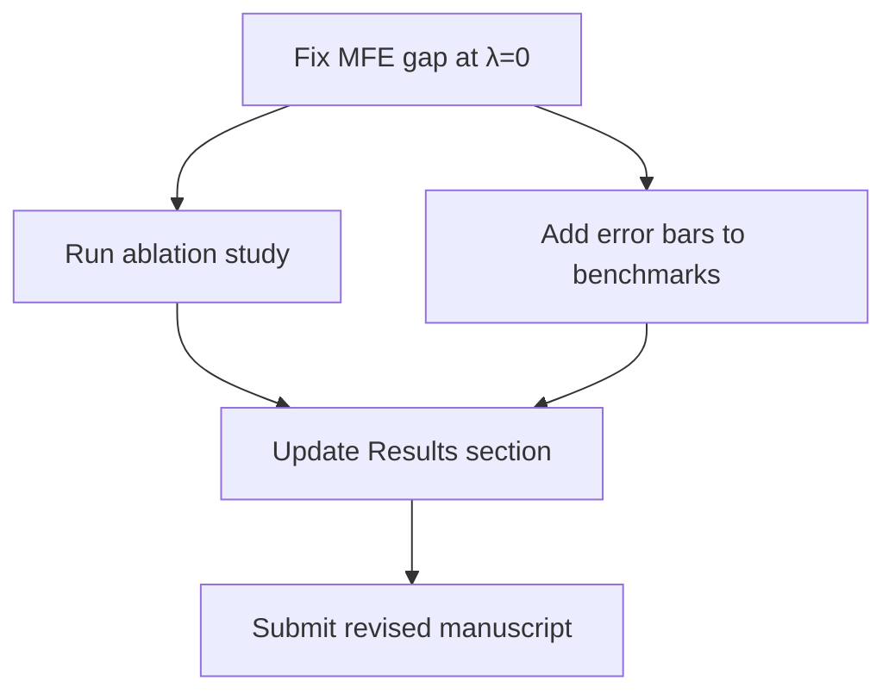

# HTML Output Format & Mermaid Diagrams

## HTML report features

- **Mermaid diagrams**: Fenced ` ```mermaid ` blocks are rendered as SVG
  diagrams automatically via Mermaid JS (loaded from CDN).
- **Collapsible reviewer cards**: Individual reviews use `<details>`
  elements — the reader expands only the perspectives they want.
- **Dark-mode support**: Stylesheet respects `prefers-color-scheme`.
- **Print-friendly**: Renders cleanly when printed or saved as PDF.
- **Table of contents**: Nav bar links to synthesis, reviews, and discussion.

## Producing HTML in manual orchestration mode

1. Write all review content as Markdown (including ` ```mermaid ` blocks).
2. Use the HTML template in `scripts/review_panel.py` (`HTML_TEMPLATE`)
   and the `_md_to_html()` converter, or write a minimal HTML wrapper:
   ```html
   <script src="https://cdn.jsdelivr.net/npm/mermaid@11/dist/mermaid.min.js"></script>
   <script>mermaid.initialize({startOnLoad: true, theme: 'neutral'});</script>
   ```
3. Wrap Mermaid blocks in `<div class="mermaid">...</div>`.

## When to use Mermaid diagrams

Good use cases inside a review report:

- **Action-plan flowcharts**: Show the recommended revision sequence as a
  dependency graph so authors can parallelise independent fixes.
- **Priority matrices**: A quadrant diagram (effort vs. impact) for the
  action items.
- **Architecture diagrams**: When explaining how parts of the algorithm or
  pipeline relate (useful for the Methods & Logic reviewer).
- **Timeline / Gantt**: If the panel recommends a staged revision plan.

Example (inside a reviewer's Markdown):

````

````

The HTML report renders this as an SVG diagram automatically.
